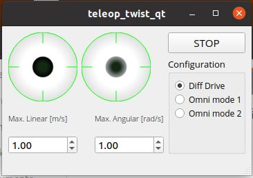

# teleop\_twist\_qt

Author: Miguel Hernando 2023.

The following ROS2 node is tested for foxy and humble. It generates a pair of virtual joysticks as seen in the screenshot. In case there is a gamepad connected to the computer through qtGamePad, it links to the physical device so that the virtual joysticks move specularly with it.

The interface generates by default a node called `/teleop_twist_qt` which publishes twists in `/cmd_vel`.

It has basically three modes of operation:

- Differential mode:Only the Left Joystick is enabled. up/down = forward/backward. left/right  = ccw rotation/cw rotation 
- Omnidirectional mode 1: left joystick up/down = forward/backward. left/right = lateral velocity. Right Joystick left/right = ccw rotation/cw rotation
- Omnidirectional mode 2: left Joystick like differential mode. Right joystick, moves the robot laterally.

If you want to modify the behavior, it is easy to work with it simply by doing:

    sudo apt install libqt5gamepad5
    sudo apt install libqt5gamepad5-dev
    
    source install/setup.bash
    cd src/teleop_twist_qt
    qtcreator .

